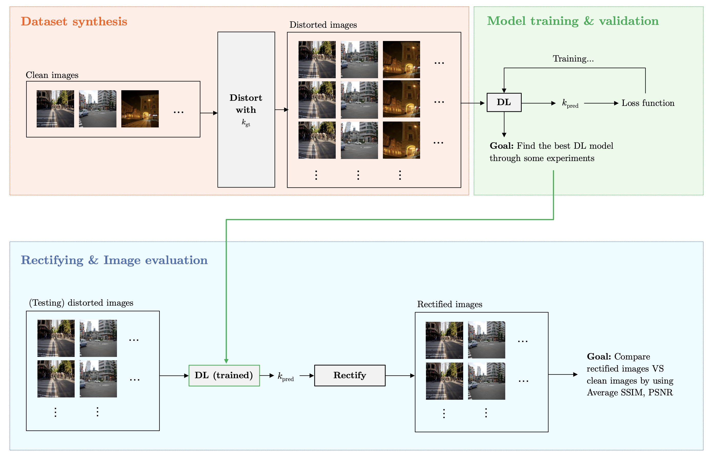
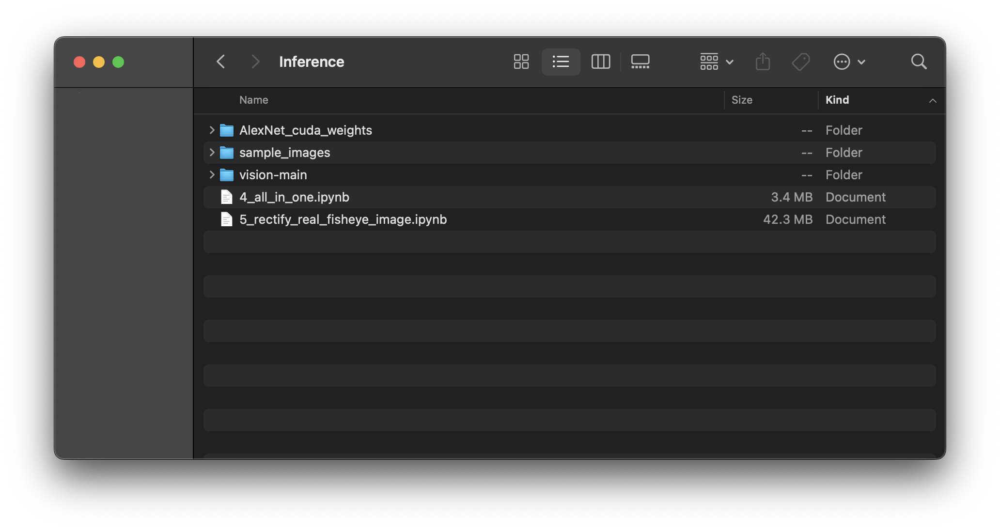

# Abstract

The widespread use of fisheye cameras in areas like autonomous driving and surveillance has highlighted the need for effective image rectification methods to address the significant distortions caused by these lenses. While deep learning has shown promise in improving rectification accuracy, many existing studies lack clarity, failing to provide model weights, codes, and detailed rectification processes, which complicates replication. This project uses a deep neural network to predict distortion parameters and the rectification program to rectify both real and synthesised fisheye images. The framework consists of three key components: dataset synthesis, model training and validation, and image rectification and evaluation. Two deep learning architectures (AlexNet and Vision Transformer) and three training schemes were explored. AlexNet delivered the best performance, particularly under Classification and Classification + Regression schemes. Moreover, the rectification program effectively corrected real fisheye images, surpassing existing methods in both image quality and quantitative metrics. This work addresses research gaps by providing comprehensive model and rectification program details and a replicable framework, laying the groundwork for future advancements in fisheye image rectification.

# Project overview

# Instructions

The detailed instructions are provided in the `Report.pdf` file. The processes of 1) Dataset synthesis, 2) Model training and validation, and 3) Image rectification and evaluation are still quite complex and will be made more user-friendly in future versions. However, in the meantime, steps 4) and 5) for inference purposes are available for testing. 

To perform only inference, create a folder containing the files and folders listed below. Then, run `4_all_in_one.ipynb` and `5_rectify_real_fisheye_image.ipynb` to view the results (instructions are provided in each .ipynb file). The results should be visible in the `sample_images` folder. You can download the folder `vision-main` from this [link](https://github.com/pytorch/vision) and `AlexNet_cuda_weights` from this [link](https://drive.google.com/drive/folders/1HyLPTIAHMNiPYm4frCbBkOFo7_NYVXcp?usp=share_link).

**It’s important to note that all input RGB images must be sized 256×256.**
